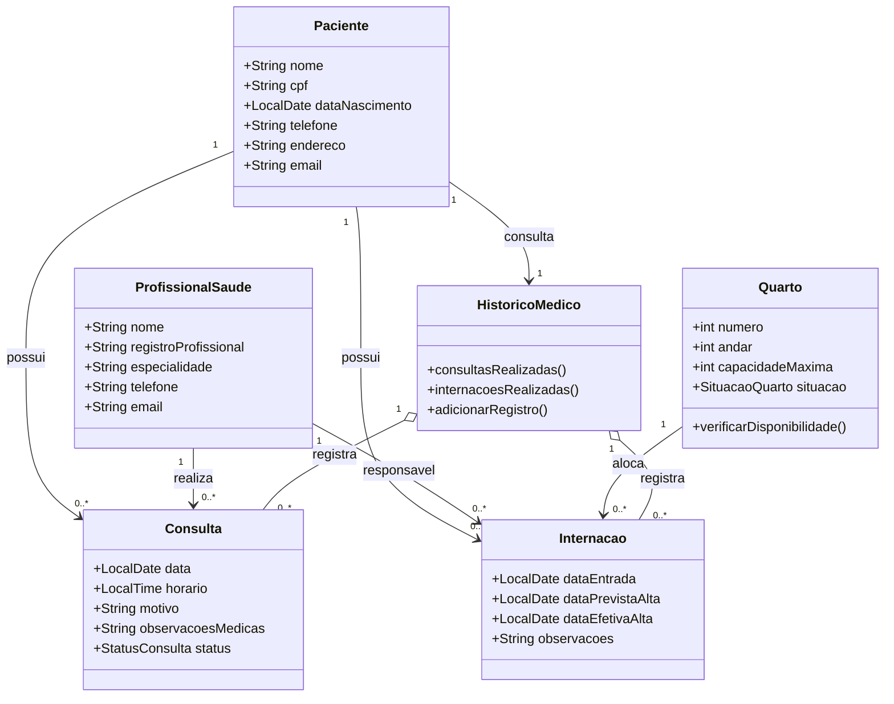

# Diagrama de Classes — Sistema de Informação Hospitalar

## 1. Classes do sistema

### Paciente

**Atributos principais:** nome, CPF, data de nascimento, telefone, endereço e e-mail.

**Responsabilidade:** manter os dados cadastrais e permitir a consulta do histórico de atendimentos.

### Profissional da Saúde

**Atributos principais:** nome, registro profissional, especialidade, telefone e e-mail.

**Responsabilidade:** informar sua especialidade, disponibilidade e assumir a responsabilidade pelos atendimentos.

### Consulta

**Atributos principais:** paciente, profissional responsável, data, horário, motivo, observações médicas e status.

**Responsabilidade:** registrar e controlar um atendimento ambulatorial, evitando conflito de horário para o profissional.

### Internação

**Atributos principais:** paciente, profissional responsável, quarto, data de entrada, data prevista de alta, data efetiva de alta e observações.

**Responsabilidade:** controlar a permanência do paciente no hospital e a ocupação do quarto associado.

### Quarto

**Atributos principais:** número, andar, capacidade máxima e situação atual.

**Responsabilidade:** informar disponibilidade e impedir que a capacidade máxima de ocupação seja ultrapassada.

### Histórico Médico

**Atributos principais:** consultas realizadas, internações realizadas e informações relevantes dos atendimentos.

**Responsabilidade:** organizar os registros de um paciente em ordem temporal para consulta médica e administrativa.

## 2. Relacionamentos

- Um **Paciente** pode possuir várias **Consultas** e várias **Internações**.
- Cada **Consulta** está associada a um **Paciente** e a um **Profissional da Saúde**.
- Cada **Internação** está associada a um **Paciente**, a um **Profissional da Saúde** e a um **Quarto**.
- Um **Quarto** pode receber internações ao longo do tempo, respeitando sua capacidade máxima.
- Um **Paciente** possui um **Histórico Médico**, que reúne suas consultas e internações.
- Um **Profissional da Saúde** não pode ter dois atendimentos agendados para o mesmo horário.

## 3. Diagrama

